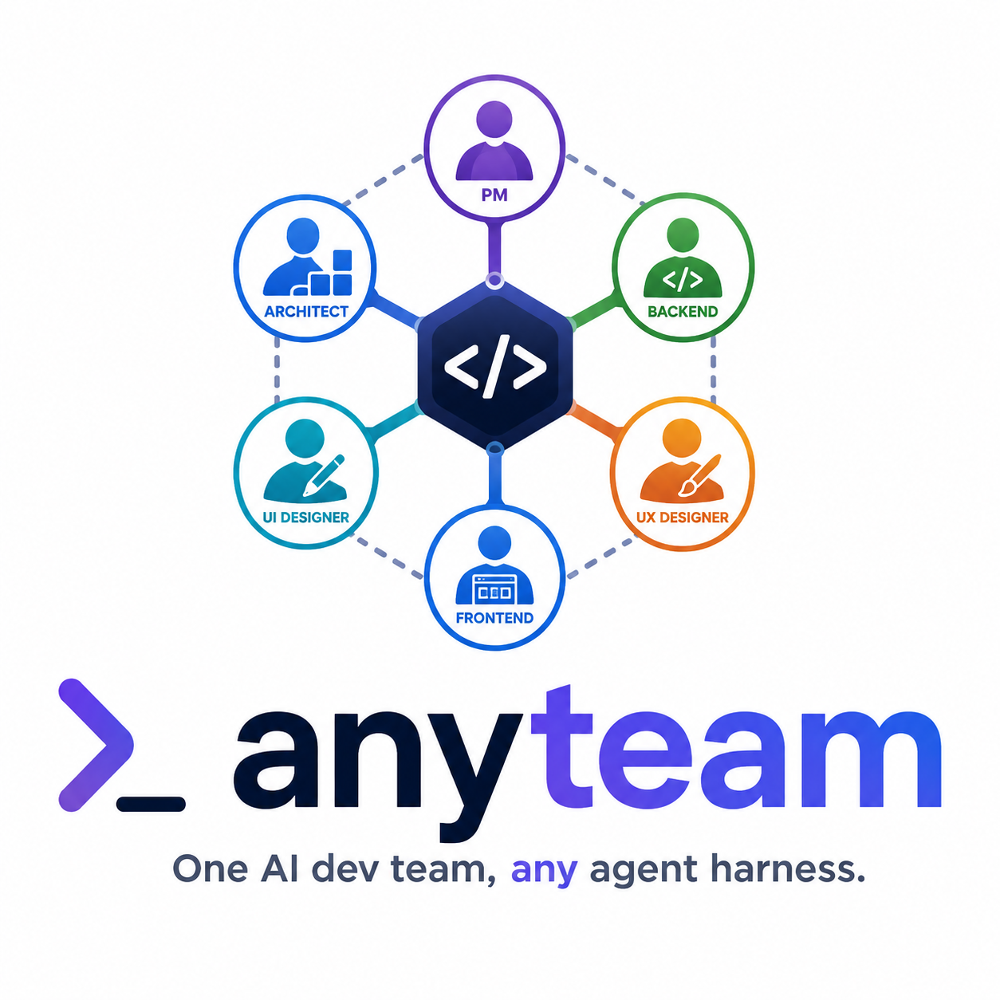
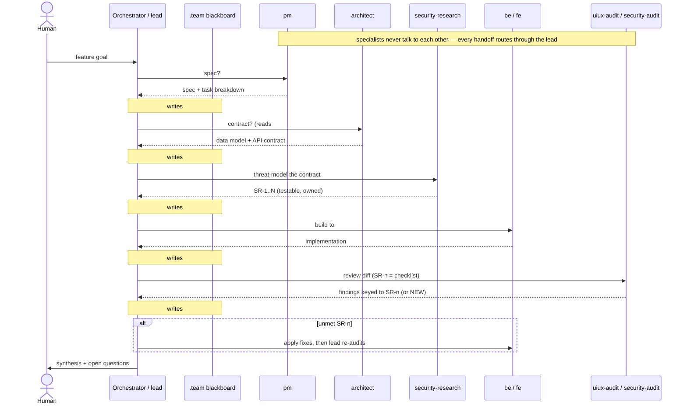

<p align="center">
  
</p>

# anyteam

**One AI dev team, any agent harness.** A portable **hub-and-spoke specialist team**
you can install into any of several AI coding harnesses with one command. The team is a small roster of role-specialised
subagents — Product Manager, Architect, Backend, Frontend, two UI/UX roles, and two
security roles — plus an operating manual that tells the lead agent how to delegate to
them and synthesise their work.

One canonical source, rendered into each harness's native subagent format. Define the
team once; install it everywhere.

## Supported harnesses

Only harnesses with a **file-definable subagent roster** (where a lead can delegate to
predefined named specialists) are supported.

| Harness | Roster location | Manual file | Model tiering |
|---|---|---|---|
| **Claude Code** | `.claude/agents/*.md` | `CLAUDE.md` | `opus` / `sonnet` |
| **OpenCode** | `.opencode/agents/*.md` | `AGENTS.md` | `anthropic/claude-*` |
| **Gemini CLI** | `.gemini/agents/*.md` | `GEMINI.md` | `gemini-2.5-pro` / `flash` |
| **Codex CLI** | `~/.codex/agents/*.toml` (user-level) | `AGENTS.md` | `gpt-5-codex` + reasoning effort |
| **Pi** | `.pi/agents/*.md` | `AGENTS.md` | `anthropic/claude-*` |

The lead role runs on the heavy tier; `pm`, `architect`, and the two security roles are
heavy, the rest are light.
Model ids are sensible defaults — tune them in [`src/harnesses.json`](src/harnesses.json)
and re-run the generator (see [Contributing](#contributing)).

## Install

```bash
git clone https://github.com/laminko/anyteam.git
cd anyteam
bash install.sh
```

Run in a terminal, the installer **prompts you** to pick the harness(es) to install
(space-separated numbers/names, or `all`; default: `claude-code`) and to confirm the
target project directory. Any flags you pass **pre-fill** those prompts, so pressing
Enter accepts them.

Or skip the prompts entirely with flags (also how piped / CI runs are driven — with no
terminal the installer doesn't prompt and falls back to flags + auto-detection):

```bash
bash install.sh --harness claude-code   # one harness
bash install.sh --harness opencode,pi   # several
bash install.sh --all                   # every supported harness
bash install.sh --dir /path/to/project  # target a different project
bash install.sh --dry-run               # show what would happen, copy nothing
```

The installer is **no-clobber by default** (it skips files that already exist; pass
`--force` to overwrite) and is plain `bash` (3.2-compatible — works with macOS system bash).

### Per-harness notes
- **Codex** installs the roster **user-level** at `~/.codex/agents/` (honors `$CODEX_HOME`)
  to avoid a project-scope spawn bug; the manual still lands in the project as `AGENTS.md`.
- **Pi** installs only the (inert) roster files by default. Making its subagents
  *work* requires a **separate, third-party community extension** — see
  [Enabling Pi subagents](#enabling-pi-subagents-opt-in) below. The installer **asks
  for your consent** before installing it.

### Enabling Pi subagents (opt-in)

The Pi roster does nothing until you install [`@tintinweb/pi-subagents`](https://www.npmjs.com/package/@tintinweb/pi-subagents)
— a **third-party community package** (MIT, maintained outside anyteam). This is the
only step in `anyteam` that runs code from outside this repo on your machine, so it's
**opt-in** — the installer **asks** (default: no) before installing it, and you can also
run it yourself, pinned to a version you've reviewed:

```bash
pi install npm:@tintinweb/pi-subagents@0.10.0
```

Then trust the project folder when Pi prompts. (Without the extension, the `.pi/agents/`
files are simply ignored — nothing breaks.)

## After install: ground the team

Installing copies files; it does not teach the team your codebase. Run the one-time
**intake** ([`INTAKE.md`](INTAKE.md)): the lead scans the repo and fills the
`## Project brief` section of the installed manual (stack, frameworks, run/build/test,
conventions, …) so every specialist inherits the project's real context. In Claude Code,
the bundled [`SKILL.md`](SKILL.md) wraps install + intake as a `/bootstrap-team` skill.

## The team

| Agent | Role | Owns |
|---|---|---|
| `pm` | Product Manager | Spec, scope, acceptance criteria (WHAT / WHY) |
| `architect` | Architect | Data model, API contract, component boundaries (HOW) |
| `be` | Backend Engineer | Server-side implementation against the contract |
| `fe` | Frontend Engineer | Client / UI against the contract |
| `uiux-audit` | UI/UX Auditor | Read-only usability / accessibility review |
| `uiux-research` | UI/UX Researcher | Patterns / evidence before building |
| `security-research` | Security Researcher | Threat model + security requirements before building |
| `security-audit` | Security Auditor | Read-only review of code / diffs for vulnerabilities |

The human talks to the **lead** (the main agent thread); the lead delegates to specialists
and synthesises their results. Specialists do not talk to each other.

## How the team works

A feature flows through a pipeline the lead adapts per task — `pm` (spec) → `architect`
(contract) → `security-research` (threat model) → `be`/`fe` (build) → `uiux-audit` +
`security-audit` (review) — and the lead synthesises the result. Coordination runs over a
**shared blackboard**: the lead curates a per-feature `.team/<feature>.md` (spec, contract,
security requirements, findings) that specialists *read*, instead of re-pasting context into
every prompt. Security is traceable end to end — `security-research` emits numbered
requirements (`SR-n`) that `be`/`fe` build to and `security-audit` verifies against.



The full operating manual ships as each harness's instruction file (`CLAUDE.md`, `AGENTS.md`,
`GEMINI.md`); the canonical source is [`src/manual.md`](src/manual.md).

## Contributing

The repo is the **source + build system**, not a pile of hand-written configs:

- Edit roles in [`src/roles/*.md`](src/roles) and the shippable manual in
  [`src/manual.md`](src/manual.md).
- Per-harness mapping lives in [`src/harnesses.json`](src/harnesses.json).
- [`generate.py`](generate.py) (Python 3, standard library only) renders `src/` →
  `dist/<harness>/`. The committed `dist/` is what `install.sh` copies.
- **Never hand-edit `dist/`.** Run `python3 generate.py`; CI fails on drift
  (`python3 generate.py --check`).

See [`CLAUDE.md`](CLAUDE.md) for the full contributor guide.

## License

[MIT](LICENSE)
